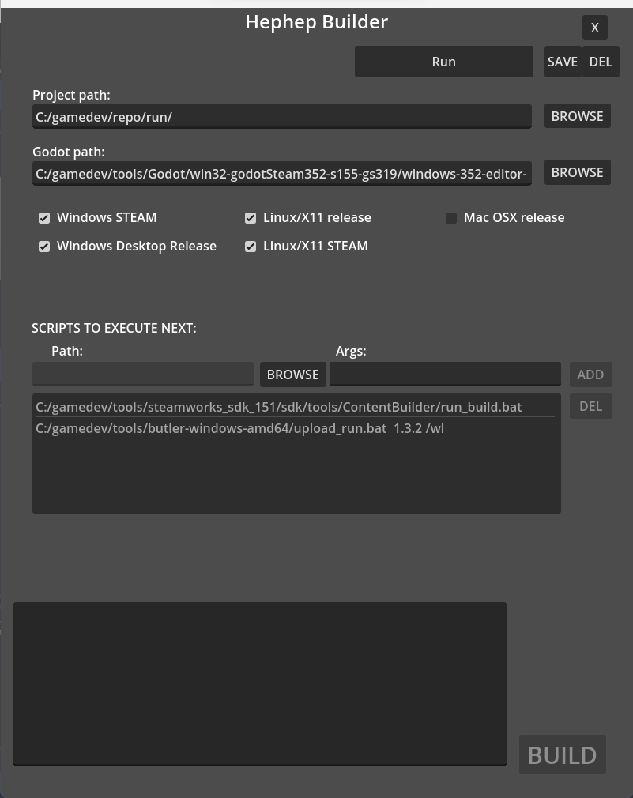

# HephepBuilder
 Custom automated builder for Godot games

 ## What is this?
 I made this tool in order to automatize builds a little when building a game for differents platforms and stores. I wanted to have a "one-button" interface that would help me save time, as I am not well organized. This project served also others purposes, entertain me and allow me to discover other Godot Nodes, Godot 4, and UI in general. 
As you may see if you tried this tools, I'm not really good at making UI yet. But the tool is functional!  

## How to use it?

* First you will have to load the path to any Godot project with the Browse button for the Project Path input. Upon selecting a folder, it will parse the project.godot file to retrieve existing export templates.
* Then, you will have to provide the Godot Editor you want to use to export you game/project. Just select the executable file with the second Browse button. 
* The next step will be to check or not the export presets you want to use to export your project. Be aware that I chose to deny editing theses export settings, so they will have to be define in your Godot Editor prior to this.
* At this point, you will be able to launch the build by pressing "BUILD" (obviously). You can also add file to be executed right after the different exports, like scripts file or external tools. You can provide arguments for each of theses tools, point to the right file with the Browse button for the script, add arguments in the corresponding fields, separated by a blank space (Maybe not the best solution for now, you can surround larger parameter with ""
if your arguments need to be of the form of "/x yyyy"). Press "ADD" to add the script to the list.
* You can edit the list by selecting any element and press "DEL" in case of mistakes.
* At any point during this configuration you can save settings by pressing the "SAVE" button at the top of the tool. Your project settings are now retrievable in the top list near the save button. You can delete save settings with de "DEL" button.
You can have only one save settings by project, sorry!
* The "BUILD" button will now export your game following the selected export settings but then will execute the scripts you inputted to the list.

## What now?
If you like this tool, you can take it as your own and do whatever you want to do with it. It would be cool if you could help me improve it with comments and code contributions. I will get back to it to improve UI, UX and code quality though.

## Why don't you use an existing tool like Jenkins?
Well, I don't know anything about Jenkins, I'm in the process of learning the tool but it's not as fun as fiddling with Godot making this cool utility. So maybe someday. The time I call allocate to learn is limited, so I felt It would be better doing my stuff.
If you are like me and only want a small and quick tool that do just what you need, maybe this is for you!
